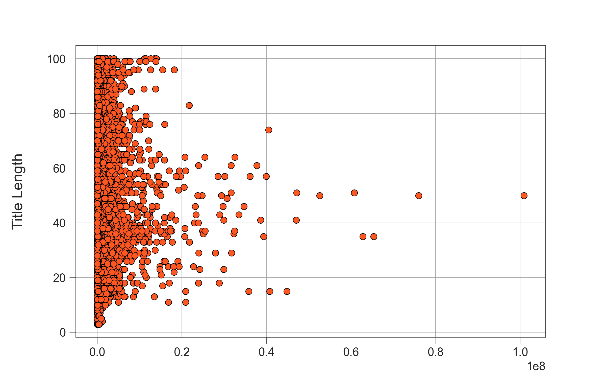

# YouTube Trending Videos Analysis

This project involves analyzing the YouTube trending videos dataset to uncover interesting patterns and insights. We employ various data visualization techniques to explore and understand the data better.

## Table of Contents

- [Introduction](#introduction)
- [Dataset](#dataset)  
- [Data Exploration](#data-exploration)
- [Visualizations](#visualizations)
  - [Title Contains Capitalized Word?](#title-contains-capitalized-word)
  - [Title Length Distribution](#title-length-distribution)
  - [Views vs. Title Length](#views-vs-title-length)
  - [Title Length Boxplot](#title-length-boxplot)
  - [Count of Capitalized Words in Titles](#count-of-capitalized-words-in-titles)
  - [Views by Capitalized Words in Titles](#views-by-capitalized-words-in-titles)
  - [Correlation Analysis](#correlation-analysis)
- [Conclusion](#conclusion)
  

## Introduction

Analyzing YouTube trending videos can provide insights into what content resonates with viewers. This project focuses on the French YouTube trending dataset, utilizing various visualization techniques to explore data attributes like title characteristics and view counts.

## Dataset

The dataset used in this analysis is the `FRvideos.csv` file, containing details of trending YouTube videos in France. It includes attributes such as title, description, views, likes, dislikes, and more.

## Data Exploration

Initial data exploration involves filling missing descriptions and summarizing basic statistics of the dataset. This helps in understanding the range and distribution of different attributes.

## Visualizations

### Title Contains Capitalized Word?

This visualization shows the proportion of video titles that contain capitalized words. It uses a pie chart to depict the percentage of titles with and without capitalized words.

### Title Length Distribution

This histogram illustrates the distribution of title lengths across all videos. It helps identify common title lengths and the spread of this attribute.

### Views vs. Title Length

A scatter plot showing the relationship between the number of views a video receives and the length of its title. This can indicate whether shorter or longer titles tend to get more views.

### Title Length Boxplot

This boxplot provides a summary of the title length distribution, highlighting the median, quartiles, and potential outliers.

### Count of Capitalized Words in Titles

A count plot representing the number of videos whose titles contain capitalized words. It helps in understanding the commonality of capitalized words in titles.

### Views by Capitalized Words in Titles

A bar plot showing the average number of views for videos with and without capitalized words in their titles. This visualization helps in analyzing whether capitalized words in titles affect view counts.

### Correlation Analysis

A heatmap displaying the correlation between different numeric attributes in the dataset. This helps in understanding the relationships between various features like views, likes, dislikes, etc.

## Conclusion

This project provides a detailed analysis of YouTube trending videos, exploring the impact of title characteristics on view counts and other metrics. The visualizations offer valuable insights into what makes a video trend.
